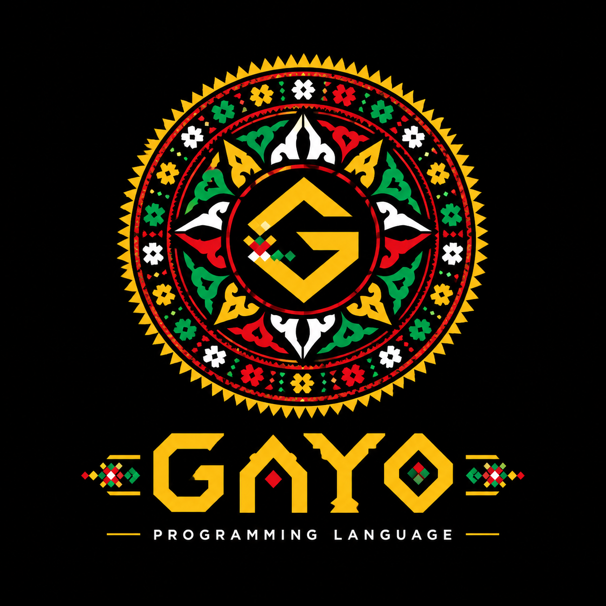

<div align="center">



# Gayo

### Native Programming Language from Aceh

**Bahasa pemrograman dengan kata kunci yang terinspirasi dari Bahasa Gayo,
dikompilasi langsung menjadi assembly x86-64 dan biner ELF native.**

<br>

**Native code, rooted in Gayo.**

</div>

---

## Tentang Gayo

**Gayo** adalah bahasa pemrograman baru dengan kata kunci dari **Bahasa Gayo** (bahasa daerah di Dataran Tinggi Gayo, Aceh). Gayo dikompilasi **langsung menjadi assembly x86-64 dan biner ELF asli** — tidak berjalan di atas interpreter atau virtual machine bahasa lain.

```
program.gy  →  gayoc (compiler, ditulis dalam C)  →  assembly x86-64
            →  nasm (assembler)  →  ld (linker)  →  biner ELF
            →  dijalankan LANGSUNG oleh CPU
```

## Instalasi

Butuh: `gcc`, `nasm`, `ld` (biasanya sudah ada di Linux, atau lewat `build-essential` + `nasm`).

```bash
sudo apt install build-essential nasm   # kalau belum ada
git clone https://github.com/khairililmi2468gmailcom/gayo-lang.git
cd gayo-lang
make
```

Opsional, supaya command `gayo` bisa dipanggil dari mana saja:

```bash
make install
```

## Pemakaian

```bash
gayo program.gy              # compile lalu langsung jalankan
gayo program.gy -o biner     # compile, simpan sebagai biner 'biner' (tidak dijalankan)
gayo program.gy --asm        # tampilkan hasil generate assembly-nya saja
gayo --version                # atau -V, tampilkan versi gayo
gayo --help                   # atau -h, tampilkan bantuan
```

Contoh cepat:

```bash
echo 'turuhen "Horas dunia!";' > halo.gy
gayo halo.gy
```

Lihat folder [`examples/`](examples/) untuk contoh lebih lengkap (faktorial rekursif, FizzBuzz, array, dll — jalankan semuanya sekaligus dengan `make test`).

## Kenapa dibuat begini (arsitektur)

Semua bahasa pemrograman baru menghadapi masalah *bootstrapping*: compiler pertamanya harus ditulis pakai bahasa yang sudah ada (C ditulis pakai assembly, Rust generasi pertama pakai OCaml, Go pakai C). Gayo tidak terkecuali — `gayoc` (compiler-nya) ditulis dalam C. Yang membedakan Gayo dari sekadar "bahasa yang diterjemahkan ke bahasa lain" adalah **hasil akhirnya**: begitu `gayoc` selesai menghasilkan file `.asm`, C tidak lagi terlibat sama sekali. File assembly itu diproses `nasm`/`ld` (alat standar sistem operasi, bukan bagian dari "logika" bahasa Gayo) menjadi biner ELF yang isinya murni instruksi CPU x86-64 — bisa dibuktikan sendiri dengan `objdump -d` pada biner hasil kompilasi.

## Dokumentasi Bahasa

### Komentar

```
!! ini komentar, sampai akhir baris
```

### Tipe data & variabel

| Kata kunci | Arti | Contoh |
|---|---|---|
| `ara` | deklarasi variabel | `ara umur = 25;` |
| `isen` | deklarasi konstanta* | `isen phi = 3.14;` |
| `bulet` | angka bulat (integer, 64-bit asli) | `ara x = 10;` |
| `arakoma` | angka pecahan** | `ara pi = 3.14;` |
| `nyintak` | teks/string | `ara nama = "Budi";` |
| `nguk` / `enggeh` | boolean benar/salah | `ara aktif = nguk;` |
| `mosop` | kosong/null | `ara data = mosop;` |
| `tong` | array | `ara arr = tong[1, 2, 3];` |

\* `isen` saat ini ditandai sebagai konstanta tapi belum ditegakkan (belum ada error kalau diubah) — lihat Roadmap.
\** `arakoma` bisa disimpan & dicetak, tapi **belum bisa dipakai dalam operasi matematika** (butuh instruksi FPU/SSE yang belum diimplementasikan) — lihat Roadmap.

### Operator

| Kata kunci | Arti |
|---|---|
| `tamah` `kurang` `kali` `bagi` | `+ - * /` |
| `lebih kul` | lebih besar (`>`) |
| `lebih kucak` | lebih kecil (`<`) |
| `lebih kul dis urum` | lebih besar sama dengan (`>=`) |
| `lebih kucak dis urum` | lebih kecil sama dengan (`<=`) |
| `dis` | sama dengan (`==`) |
| `gere dis` | tidak sama dengan (`!=`) |
| `urum` | dan (`&&`) |
| `ataupe` | atau (`||`) |
| `nume` | bukan/negasi (`!`) |

### Cetak ke layar

```
turuhen "teks langsung";
turuhen nama_variabel;
turuhen (5 tamah 3);          !! ekspresi juga bisa langsung dicetak
```

### Kontrol alur

```
ike (kondisi) {
    ...
} ike gere (kondisi_lain) {
    ...
} kegere {
    ...
}

iwan (kondisi) {
    ...          !! while
}

kin (ara i = 0; i lebih kucak 10; i = i tamah 1) {
    ...          !! for, gaya C
    teduh;       !! break
    lanyut;      !! continue
}
```

### Fungsi (mendukung rekursi)

```
kinsa faktorial(n) {
    ike (n lebih kucak dis urum 1) {
        ulaken 1;
    }
    ulaken n kali faktorial(n kurang 1);
}

ara hasil = faktorial(5);     !! dipakai sbg ekspresi
talun faktorial(5);           !! dipanggil, hasil diabaikan
```

### Array (tong)

```
ara arr = tong[10, 20, 30];
turuhen arr[0];        !! 10
arr[1] = 99;
turuhen arr[1];        !! 99
```

> Array saat ini hanya didukung sebagai variabel **global** (di luar fungsi).

## Contoh program

Lihat [`examples/`](examples/):
- `halo.gy` — program pertama
- `variabel.gy` — semua tipe data dasar
- `faktorial.gy` — fungsi rekursif
- `fizzbuzz.gy` — FizzBuzz klasik
- `array.gy` — operasi array


## Struktur proyek

```
gayo-lang/
├── gayoc.c          # compiler Gayo (ditulis dalam C)
├── gayo             # script command-line: gayo namafile.gy
├── Makefile
├── examples/        # contoh program .gy
└── README.md
```

## Gayo Programming Language

**Gayo Programming Language** dikembangkan oleh **Khairil Ilmi**, dengan tujuan menghadirkan bahasa pemrograman native yang menggunakan kata kunci yang terinspirasi dari Bahasa Gayo.

## Lisensi

Proyek ini menggunakan **MIT License**. Lihat file [`LICENSE`](LICENSE) untuk informasi lengkap mengenai ketentuan lisensi.